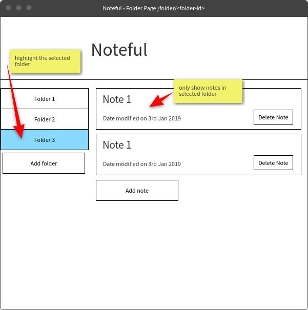

# Assignment
You're going to build an application called **Noteful**. This application will be built up over several checkpoints as we first create the design and basic components with routing, and then move onto integrating the API calls. We'll also be building the back-end for this application in the Node curriculum!

To start, create a new `create-react-app` project called `noteful` and remove the boilerplate code to have a clean starting point.

This assignment is to build the basic components for 3 routes based off of the wireframes we'll supply below. You don't need to implement any API calls or functionality to manage the notes just yet as we'll get to that in later checkpoints.

#### Requirements

There are 3 routes to build: the main route, the dynamic folder route, and a dynamic note route. We'll supply you with 3 wireframes for each of these pages and you'll then need to create the semantic (accessible) HTML for these as well as basic styling.

- Each route should have a header, main section, and a sidebar section

- Every route will have the same header section, the app's title should be a link to the main route

- The state will be supplied below in a JSON object and contains an array of `folders` and an array of `notes`

    - Set the state inside the main App component (we'll use an API call to populate this state in a future checkpoint)

- The **main** route:

    - Should be displayed when the path is /
    - The main section will display all of the available notes
        - Each note should show its name and modified date
    - The sidebar will display a list of folders with none selected

- The dynamic **folder** route:

    - Should be displayed when the path is `/folder/<with-a-folder-id-here>`
    - The `folder-id` will reference an id of one of the folders in state
    - The main section should display only the notes that are "in" the selected folder
    - The sidebar should display the folder list with the selected folder highlighted

- The dynamic **note** route:

    - Should be displayed when the path is /note/<with-a-note-id-here>
    - The note-id will reference an id of one of the notes in state
    - The main section should display the currently selected notes name, modified date and content
    - The sidebar should display the folder of the currently selected note as well as a "back" button.

This assignment is the biggest one for your React journey so far and should take about 4 hours to complete. If you're having trouble, attend a Q&A session or reach out on Slack for help.

#### Dummy data

Use this **[dummy-store.js](https://gist.github.com/tomatau/a1686a9af624dd39f753de8ce90fd345)** as a file in your project to populate the initial state.

#### Wireframes

The main route:


The folder route:



The note route:


#### Hints

Hints for the App component:

- Use sets of Route components: one set for the main content and another set for the sidebar. Each set of routes can be configured using the same paths, but different components. For example:
```javascript
function Example() {
  return <>
    <Sidebar>
      <Route path='/' component={MainSidebar} />
      <Route path='/foo' component={FooSidebar} />
    </Sidebar>
    <Main>
      <Route path='/' component={MainMain} />
      <Route path='/foo' component={FooMain} />
    </Main>
  </>
}
```

- In order to pass props into components for specific routes, you'll need to use the `render` prop on `Route` components in a similar way to when we added programmatic navigation to the bookmarks app. For example:
```javascript
<Route
  path='/foo'
  render={(routerProps) =>
    <FooSidebar
      aFoo={this.state.foos.find(foo => foo.id === routeProps.match.params.foodId)}
    />
  }
/>
```

- The main route and the folder route could use the same component with a different list of notes passed in as props.

The folder route:

- Instead of using `Link` components in the sidebar for each folder, you can use the React-Router `NavLink` component that will automatically add a `className` of `"active"` when appropriate.
- You'll need to filter for the notes that contain a matching `folderId` to the folder that's selected when deciding which notes to display.